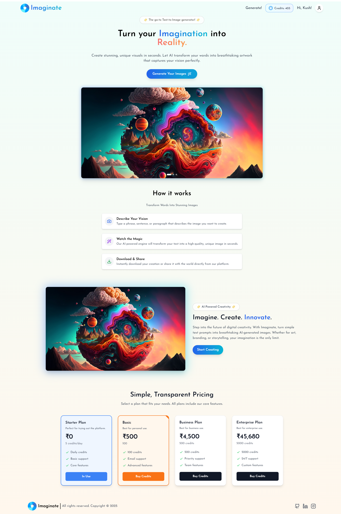

# Imaginate

**Imaginate** is an innovative AI-powered platform designed to transform your text prompts into stunning, high-quality images. Whether you're an artist, designer, or someone with a creative vision, Imaginate empowers you to bring your imagination to life effortlessly. With a user-friendly interface and cutting-edge technology, Imaginate is your go-to tool for creative expression.

---

## 🌟 Key Features

- **AI-Powered Image Generation**: Generate breathtaking visuals from simple text prompts in seconds.
- **Intuitive Interface**: A seamless and responsive design ensures an effortless user experience.
- **Flexible Pricing Plans**: Choose between free and premium plans tailored to your needs.
- **Secure Payments**: Integrated with Stripe for safe and hassle-free transactions.
- **Real-Time Credit Management**: Monitor and manage your credits directly from your dashboard.
- **Download & Share**: Instantly download your creations or share them with the world.

---

## 🚀 How It Works

1. **Describe Your Vision**: Enter a text prompt describing the image you want to create.
2. **AI Magic**: Our advanced AI engine generates a unique, high-quality image based on your input.
3. **Download & Share**: Save your creation or share it directly from the platform.

---

## 🖼️ Screenshots

### Home Page



### AI-Generated Image Example

<div style="display: flex; flex-wrap: wrap; gap: 10px;">
  
  
  
  
</div>

---

## 📦 Tech Stack

### Frontend

- **React**: For building the user interface.
- **Vite**: For fast development and build processes.
- **Tailwind CSS**: For modern and responsive styling.
- **Framer Motion**: For smooth animations and transitions.

### Backend

- **Node.js**: For server-side logic.
- **Express.js**: For building RESTful APIs.
- **MongoDB**: For database management.
- **Stripe**: For payment processing.

---

## 🛠️ Installation

### Prerequisites

- Node.js (v16 or higher)
- MongoDB
- Stripe account for payment integration

### Steps

1. Clone the repository:
   ```bash
   git clone https://github.com/KushagraShukla004/Imaginate.git
   cd Imaginate
   ```
2. Install dependencies:
   ```bash
   cd client
   npm install
   cd ../server
   npm install
   ```
3. Set up environment variables:
   - Create a `.env` file in the `server` directory.
   - Add the following variables:
     ```
     MONGO_URI=<your-mongodb-connection-string>
     STRIPE_SECRET_KEY=<your-stripe-secret-key>
     ```
4. Start the development servers:
   ```bash
   cd server
   npm run dev
   cd ../client
   npm run dev
   ```

---

## 🤝 Contributing

We welcome contributions! If you'd like to contribute, please fork the repository and submit a pull request. For major changes, open an issue first to discuss what you'd like to change.

---

## 📄 License

This project is licensed under the GNU General Public License v3.0.[GNU License](LICENSE).

---

## 📧 Contact

For any inquiries or feedback, feel free to reach out:

- **Email**: [Kushagra Shukla](shuklasamrat007@gmail.com)
- **GitHub**: [KushagraShukla004](https://github.com/KushagraShukla004)
- **LinkedIn**: [Kushagra Shukla](https://www.linkedin.com/in/kushagra-shukla101/)
